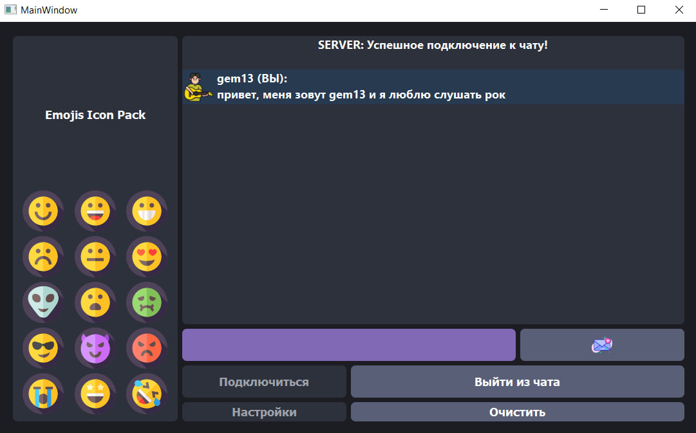
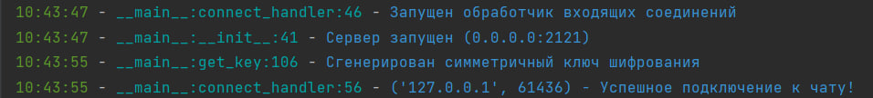

# WallMall-Corporation

Эта версия приложения Wall Mall реализует клиент-серверную топологию сетевого взаимодействия. Сервер (server.py) слушает входящие соединения от клиентов, принимает их запросы, обрабатывает сообщения и отправляет ответы. Каждый клиент, который подключается к серверу, получает уникальный симметричный ключ для шифрования сообщений.

Таким образом, все клиенты связываются с сервером, обмениваются зашифрованными сообщениями и могут отправлять запросы о завершении соединения.

Используемые технологии включают в себя сокеты для сетевого взаимодействия(какая неожиданность), модули для сериализации данных (json, pickle), базовую кодировку base64, многопоточное программирование для обработки клиентов, а также библиотеку cryptography для работы с шифрованием.

## Почему эта версия приложения идеально подходит для небольших организаций и предприятий?

Использование этого приложение в частной организации дает такие преимущества как:

- Защищенность пользовательских данных. Все данные хранятся на сервере предприятия в распределенном виде, что усложняет их компрометацию
- Быстродействие и стаильность работы приложения.
  

## Добавлено к основному приложению:

###  Функциональные решения

- Улучшено шифрование
- 2-х факторная аутенфикация(faceID + пароль, электронный ключ + пароль, код восстановления + пароль)
- Изменение технологии передачи сообщений
- Использование различных параметров
- Добавлена функция передачи файлов

###  Графический интерфейс

- Добавлены эмодзи
- Переход к material design
- Консольный сервер с простым и понятным выводом
